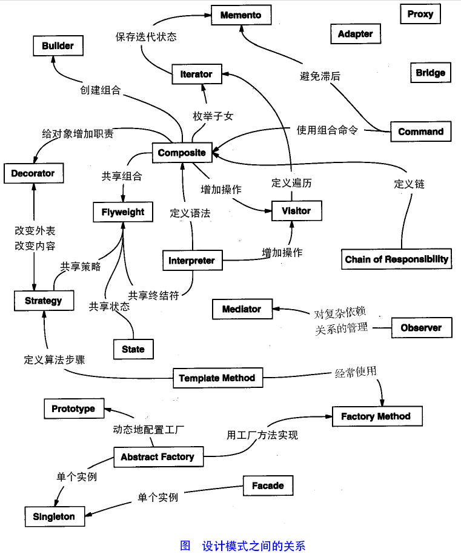

# 简介 

1. 设计模式（Design pattern）代表了最佳的实践，通常被有经验的面向对象的软件开发人员所采用。设计模式是软件开发人员在软件开发过程中面临的一般问题的解决方案。这些解决方案是众多软件开发人员经过相当长的一段时间的试验和错误总结出来的。

2. 设计模式是一套被反复使用的、多数人知晓的、经过分类编目的、代码设计经验的总结。使用设计模式是为了重用代码、让代码更容易被他人理解、保证代码可靠性。 毫无疑问，设计模式于己于他人于系统都是多赢的，设计模式使代码编制真正工程化，设计模式是软件工程的基石，如同大厦的一块块砖石一样。项目中合理地运用设计模式可以完美地解决很多问题，每种模式在现实中都有相应的原理来与之对应，每种模式都描述了一个在我们周围不断重复发生的问题，以及该问题的核心解决方案，这也是设计模式能被广泛应用的原因

 

| 序号  | 模式&描述                                                                                     | 包括                                                                                                                                                                                                                                                                                                                                                     |
|-----|-------------------------------------------------------------------------------------------|--------------------------------------------------------------------------------------------------------------------------------------------------------------------------------------------------------------------------------------------------------------------------------------------------------------------------------------------------------|
| 1   | **创造型模式** 这些设计模式提供了一种在创建的同时隐藏创建逻辑的方式，而不是使用new运算符直接实例化对象。这使得程序在判断针对某个给定实例需要创建哪些对象时更加灵活 | 工厂模式（Factory Pattern） 抽象工厂模式（Abstract Factory Pattern） 单例模式（Singleton Pattern） 建造者模式（Builder Pattern） 原型模式（Prototype Pattern）                                                                                                                                                                                                          |
| 2   | **结构型模式**   这些设计模式关注类和对象的组合。继承的概念被用来组合接口和定义组合对象获得新功能的方式                               | 适配器模式（Adapter Pattern） 桥接模式（Bridge Pattern） 过滤器模式（Filter、Criteria Pattern） 组合模式（Composite Pattern） 装饰器模式（Decorator Pattern） 外观模式（Facade Pattern） 享元模式（Flyweight Pattern） 代理模式（Proxy Pattern）                                                                                                                               |
| 3   | **行为性模式**   这些设计模式特别关注对象之间的通信                                                         | 责任链模式（Chain of Responsibility Pattern） 命令模式（Command Pattern） 解释器模式（Interpreter Pattern） 迭代器模式（Iterator Pattern） 中介者模式（Mediator Pattern） 备忘录模式（Memento Pattern） 观察者模式（Observer Pattern） 状态模式（State Pattern） 空对象模式（Null Object Pattern） 策略模式（Strategy Pattern） 模板模式（Template Pattern） 访问者模式（Visitor Pattern） |
| 4   | **J2EE 模式**    这些设计模式特别关注表示层。这些模式是由 Sun Java Center 鉴定的。                              | MVC 模式（MVC Pattern） 业务代表模式（Business Delegate Pattern） 组合实体模式（Composite Entity Pattern） 数据访问对象模式（Data Access Object Pattern） 前端控制器模式（Front Controller Pattern） 拦截过滤器模式（Intercepting Filter Pattern） 服务定位器模式（Service Locator Pattern） 传输对象模式（Transfer Object Pattern）                                                        |

### 总得来讲
1. 创建型模式-->对象怎么来
2. 结构型模式-->对象和谁有关
3. 行为型模式-->对象与对象在干嘛
4. J2EE 模式-->对象合起来要干嘛（表现层,文中表示层个人感觉用的不准确）java是面向对象的语言,所以要搞好对象,模式（套路）就是用来更加好的搞对象滴。

## 设计模式类型事例

1. 创建型模式
* FACTORY？加工工厂：给它“M4A1”，它给你产把警枪，给它“AK47”，你就端了把匪枪。CS里买枪的程序一定是用这个模式的。
* BUILDER？生产流水线：以前是手工业作坊式的人工单个单个的生产零件然后一步一步组装做，好比有了工业革命，现在都由生产流水线代替了。如要造丰田汽车，先制定汽车的构造如由车胎、方向盘、发动机组成。再以此构造标准生产丰田汽车的车胎、方向盘、发动机。然后进行组装。最后得到丰田汽车；
* PROTOTYPE？印刷术的发明：以前只能临贴抄写费时费力，效率极低，有了印刷术，突突的；
* SINGLETON？确保唯一：不是靠new的，是靠instance的，而且要instance地全世界就这么一个实例(这可怜的类，也配叫“类”)。 看SingleTon类代码。
2. 结构型模式
* ADAPTER？翻译官：胡哥只会汉语，布什只会美语，翻译官既通汉又通美，Adapter了 ；
* DECORATOR？装饰：名字可以标识一个人，为了表示对一个人的尊重，一般会称其为“尊敬的”，有了装饰，好看多了；
* BRIDGE？白马非马：马之颜色有黑白，马之性别有公母。我们说"这是马"太抽象，说"这是黑色的公马"又太死板，只有将颜色与性别和马动态组合，"这是（黑色的或白色的）（公或母）马"才显得灵活而飘逸，如此bridge模式精髓得矣。
* COMPOSITE？大家族：子又生孙，孙又生子，子子孙孙，无穷尽也，将众多纷杂的人口组织成一个按辈分排列的大家族即是此模式的实现；
* FACADE？求同存异：高中毕业需读初中和高中，博士也需读初中和高中，因此国家将初中和高中普及成九年制义务教育；
* FLYWEIGHT？一劳永逸：认识三千汉字，可以应付日常读书与写字，可见头脑中存在这个汉字库的重要；
* PROXY？垂帘听政：犹如清朝康熙年间的四大府臣，很多权利不在皇帝手里，必须通过辅佐大臣去办；
3. 行为模式
* CHAIN OF RESPONSIBLEITY？租房：以前为了找房到处打听，效率低且找不到好的房源。现在有了房屋中介，于是向房屋中介提出租房请求，中介提供一个合适的房源，满意则不再请求，不满意继续看房，直到满意为止；
* COMMAND？借刀杀人：以前是想杀谁就杀，但一段时间后领悟到，长此以往必将结仇太多，于是假手他人，挑拨他人之间的关系从而达到自己的目的；
* INTERPRETER？文言文注释：一段文言文，将它翻译成白话文；
* ITERATOR？赶尽杀绝：一个一个的搜索，绝不放掉一个；
* MEDIATOR？三角债：本来千头万绪的债务关系，忽出来一中介，包揽其一切，于是三角关系变成了独立的三方找第四方中介的关系；
* MEMENTO？有福同享：我有多少，你就有多少；
* OBSERVER？看守者：一旦被看守者有什么异常情况，定会及时做出反应；
* STATE？进出自由：如一扇门，能进能出，如果有很多人随时进进出出必定显得杂乱而安全，如今设一保安限制其进出，如此各人进出才显得规范；
* STRATEGY？久病成良医：如人生病可以有各种症状，但经过长期摸索，就可以总结出感冒、肺病、肝炎等几种；
* TEMPLATE METHOD？理论不一定要实践：教练的学生会游泳就行了，至于教练会不会则无关紧要；
* VISITOR？依法治罪：因张三杀人要被处死，李四偷窃要被罚款。由此势必制定处罚制度，故制定法律写明杀人、放火、偷窃等罪要受什么处罚，经通过后须变动要小。今后有人犯罪不管是谁，按共条例处罚即是，这就是访问者模式诞生的全过程。
  

| Key        | Value                                                        | Description                                                  |
| ---------- | ------------------------------------------------------------ | ------------------------------------------------------------ |
| id         | str                                                          | 停车位的唯一识别id,例如：“A101”,"13"等                       |
| coordinate | ((x,y),(x,y))                                                | 停车位的对角坐标，绘制出停车位的矩形框                       |
| status     | 0：可用（空车位） 1: 不可用-未指明原因  2：不可用 - 有车辆占用 3：不可用 - 有地锁占用 | x, y, z 位置，单位                                           |
| stopper    | L                                                            | 停车器距离停车位末端的长度，单位米。==没有必要区分长轮档和短轮档== |